# 元能力测评 V1.6｜完整30题与逐题审查

本轮修订：N01由持续显示改为学生点击、图片加载完成后展示8秒，倒计时结束收起后作答；8秒内仍可能计数，不作为纯粹近似数感指标。不改变数理归属和任务计分。中断后明确提示并更换同数量新布局；完整观看后的刷新不重播。M05每题保留六个位置选项，原始正确答案ID及坐标不变。目标仍在下排，跨题位置分布线索尚未消除。新旧呈现版本不直接混比。
取消奇偶任务均分差50个百分点对应的一致性硬门槛；保留描述数值但不作信度估计，不新增两题分差判定规则。保存材料结束时间及六项记忆任务的入题、提交保持间隔；展示中断或时间不可用记为null，时间不进入评分。删除学生端长评分说明，解释边界保留在内部审计及报告首段。
生成日期：2026-09-07；题库交付版本：1.6-student-8s-20260907。题目引导、全部报告板块及页尾改为学生用语；已确认能力名称、正确答案、选项、计分及学科需求值≥3展示规则不变。新版本使用独立会话键，不覆盖旧版作答记录。

### 选项顺序与记录说明

本表的A/B/C/D均为题库原始ID，不代表学生看到的固定顺序。新会话生成并保存全部选项顺序（session-options-2）；刷新和继续测评复用原顺序。正确性仍按原始ID判分，每任务满分1分，多次作答取内部正确率。

普通文字与图形选项按会话重新排列；S01—S04及S06第二题的候选图形整块换位，图中与按钮按相同的A/B/C/D顺序显示，图形内部几何与标记不变。数轴和位置转换图中有意义的点位不移动，仅同步更新展示字母。N01左右判断与M05六格位置板保留真实方位，不进行可能改变题意的空间重排；记录中以spatial-fixed明确标注，不计作已经打乱位置。

本地记录保存optionOrders及每题optionAudit，包含原始ID、原始位置、展示位置、展示标识和所选项映射。位置使用1起算；M05展示位置按六格板从左到右、从上到下编号。内部复核通过reviewDisplayedOptions按原始ID关联图形、答案和干扰项解释；不要将本表原始字母直接当作学生展示字母。

当前交付仍为本地联调HTML，尚无接收数据的后台服务。提交接口已携带会话、版本与选项映射字段；正式上线须由服务端登记会话顺序、保存记录并根据服务端题库判分，不能信任客户端提交的正确性或自报映射。新版使用独立存储键，旧版记录不会被删除，但不混入新版继续作答。

本轮保留30任务、65次作答、计分公式和学科映射规则，未继续增加难度。学生端名称改为“元能力学习画像”，报告将高项标为待验证，并说明各组难度尚未校准，分差不等于能力差距。05保留完整学、背、练、补内容，补充实际动作与试用记录入口。

学生报告已移除预测试反馈表单、各学科重复试用提醒和页尾口号。已有本机pilotFeedback历史记录保留，不删除作答、计时或选项映射。各组题目尚未完成难度校准，原始得分不可直接解释为跨能力强弱；学生端用简短白话保留这一边界。03展示学科底盘表中需求值≥3的能力，仍按原规则分组，不改评分与映射。

## 1. 修改前后对照表

| 项目 | 修改前 | 修改后 |
| --- | --- | --- |
| 题库来源 | V1.5候选题加覆盖层 | V1.6单一事实来源，同时生成页面、答案与审计 |
| 任务权重 | 多小题按点击数累计 | 每任务1分，多小题内部正确率折算 |
| 语言与推演 | 部分语言题承担多条件推理 | 语言聚焦句意、组织、表达辨析；推演独立承接逻辑 |
| 记忆材料 | 即时与延迟题可能重复正确材料 | 视觉A/B、语义C/D子集隔离，4/5/6项序列独立 |
| 空间结构 | 折叠和长路径负荷较多 | 只保留1个展开图，增加补线、拼合与两步路径 |
| 数理知识依赖 | 包含百分比、公式化表达 | 使用小整数、非符号数量、变化与新符号规则 |
| 报告边界 | 二级能力容易被理解为精细结论 | 五项元能力为主结果，二级能力只作解释性信号 |
| 时长核算 | 主要按30个任务单元估计 | 同时核算实际选择次数、材料、操作说明和切换；结论待预测试 |

## 2. 记忆材料呈现与延迟流程

| 材料 | 呈现时点 | 呈现时间 | 内容 |
| --- | --- | ---: | --- |
| visual-board | M01 | 24秒 |       |
| semantic-pairs | M02 | 24秒 | 洛米—发蓝光；塔格—怕雨；奈朴—会折叠；西岚—靠近水会变轻；伏可—晚上发热；墨迩—碰金属会响 |
| sequence-4-5 | S03 | 18秒 | 四项：◆　○　▲　■；五项：☂　◇　☀　♧　★ |
| sequence-6 | S06 | 12秒 | ⬟　☾　✚　◈　◇　☁ |

视觉位置板中，M01只考VA1—VA3是否出现，M05只考VB1—VB3原始位置；语义材料中，M02只考SC1—SC3即时配对，M04只考SD1—SD3延迟配对。即时题的题干和选项不出现延迟子集。M03的两组序列在S03之前呈现，完成S03与R03两个其他任务后才在M03作答；M06不再选择完整序列，而是在相似干扰中提取第2、4、5位。

编号仅用于内部审计，不出现在学生可见文字、提示或无障碍名称中。视觉材料与M01选项、M05目标共用SVG。M01直接选图，M05先看图再选位置；语义材料保留虚构对象名称，删除分组编号。去掉外部名称提示并不能阻止学生自行给图形命名，这一策略影响仍需通过预测试访谈记录。

## 3. 完整30个任务、内部标注与答案解析

### 01｜M01｜记忆·快速记住

- 主要测量元能力：记忆
- 对应二级能力：快速记住
- 可能同时调用：空间
- 题型：visual-recognition
- 为什么能测目标能力：材料只呈现一次，随后立即撤去；正确作答必须保留新图形或虚构配对，而不能从常识补出答案。
- 可能受其他能力影响：空间（不作为本题主结论）
- 难度：基础
- 预计作答时间：20秒
- 知识依赖风险：低；只需识别刚呈现的抽象图形。
- 阅读依赖风险：低；题干短，无长文本。
- 题型经验风险：低；使用常见的出现／未出现判断。
- 任务计分：内部3次作答先求正确率，再折算为本任务1分
- 学生题干：图形识别记忆：选出刚才看过的图形。

#### M01-1

**学生端题目：** 下面哪一个图形出现在位置板上？

**选项：** A．（内部标注：月牙形 VA1）　B．（内部标注：月牙加一点）　C．（内部标注：朝向相反的月牙）　D．（内部标注：五角星形）

**正确答案：** A

**标准推导：** 位置板左上呈现的是月牙形VA1，另外三项分别改变了局部特征、朝向或整体形状。

**唯一答案检查：** 逐项代入题干条件后，仅正确项同时满足全部条件，其余选项各有一处明确冲突。

**其他选项不成立：**

- B：把局部增添的相似干扰当成原图。
- C：把镜像干扰当成原图。
- D：五角星没有出现。

#### M01-2

**学生端题目：** 下面哪一个图形出现在位置板上？

**选项：** A．（内部标注：单独圆环）　B．（内部标注：钥匙孔形 VA2）　C．（内部标注：双圆带长柄）　D．（内部标注：实心圆带短柄）

**正确答案：** B

**标准推导：** 位置板中上呈现的是空心圆与短柄组成的钥匙孔形VA2。

**唯一答案检查：** 逐项代入题干条件后，仅正确项同时满足全部条件，其余选项各有一处明确冲突。

**其他选项不成立：**

- A：遗漏了短柄。
- C：多记了一个圆和更长的柄。
- D：混淆了空心与实心特征。

#### M01-3

**学生端题目：** 下面哪一个图形出现在位置板上？

**选项：** A．（内部标注：单个拱形）　B．（内部标注：三段波浪）　C．（内部标注：双拱形 VA3）　D．（内部标注：双拱形加竖线）

**正确答案：** C

**标准推导：** 位置板右上呈现的是两个相连拱形VA3，数量和附加线均与C一致。

**唯一答案检查：** 逐项代入题干条件后，仅正确项同时满足全部条件，其余选项各有一处明确冲突。

**其他选项不成立：**

- A：少记了一个拱。
- B：多记了一个拱。
- D：加入了原图没有的竖线。

### 02｜L01｜语言·理解意思

- 主要测量元能力：语言
- 对应二级能力：理解意思
- 可能同时调用：记忆
- 题型：notice-scope
- 为什么能测目标能力：选项系统改变对象、范围、否定或指代；只有准确理解原句边界才能排除近义误读。
- 可能受其他能力影响：记忆（不作为本题主结论）
- 难度：基础
- 预计作答时间：22秒
- 知识依赖风险：低；只涉及日常通知语义。
- 阅读依赖风险：低；每段不超过两句。
- 题型经验风险：低；常规单选。
- 任务计分：内部2次作答先求正确率，再折算为本任务1分
- 学生题干：阅读通知，选择与原意一致的一项。

#### L01-1

**学生端题目：** “本周阅览区照常开放，借还服务移到一楼；周五下午仅暂停还书，借书不受影响。”

**选项：** A．周五下午一楼仍可借书，但不能还书　B．周五下午暂停借书，还书仍在一楼办理　C．周五下午阅览区关闭，一楼仅办理借书　D．本周阅览区移到一楼，周五下午暂停还书

**正确答案：** A

**标准推导：** 借还地点是一楼；周五下午暂停的仅为还书，借书照常。A同时保留两项信息。

**唯一答案检查：** 逐项代入题干条件后，仅正确项同时满足全部条件，其余选项各有一处明确冲突。

**其他选项不成立：**

- B：对调了暂停和保留的服务。
- C：将服务暂停扩大为阅览区关闭。
- D：把借还服务迁移误读为阅览区迁移。

#### L01-2

**学生端题目：** “申请表周三18点截止提交。已经提交的表格，周四中午前可更正联系方式，其他内容不再修改。”

**选项：** A．周四中午前仍可提交申请，并修改联系方式　B．周三截止提交，之后至周四中午前仅可改联系方式　C．周三截止提交，周四中午前可修改表中所有内容　D．周三截止后表格不能再改，包括联系方式

**正确答案：** B

**标准推导：** 提交与更正有不同期限；更正仅限联系方式。B同时保留时间和范围。

**唯一答案检查：** 逐项代入题干条件后，仅正确项同时满足全部条件，其余选项各有一处明确冲突。

**其他选项不成立：**

- A：混淆提交与更正的截止时间。
- C：扩大允许更正的内容。
- D：遗漏联系方式的更正窗口。

### 03｜N01｜数理·感知数量

- 主要测量元能力：数理
- 对应二级能力：感知数量
- 可能同时调用：空间
- 题型：eight-second-dot-array-comparison
- 为什么能测目标能力：点阵加载后呈现8秒，收起后作答，观察数量比较表现。8秒内仍可能计数，不作为纯粹近似数感指标；记忆保持间隔按实际时间记录，不参与计分。
- 可能受其他能力影响：空间（不作为本题主结论）
- 难度：基础
- 预计作答时间：20秒
- 知识依赖风险：低；不使用数字、公式或学科概念。
- 阅读依赖风险：低；题干极短。
- 题型经验风险：中；图片呈现8秒，仍可能使用计数策略；点阵边界与总着色面积已控制，点大小略有变化。本题观察数量比较，不单独解释为近似数感。
- 任务计分：内部2次作答先求正确率，再折算为本任务1分
- 学生题干：观察两侧点阵，选择点更多的一侧。

#### N01-1

**学生端题目：** 哪一侧的点更多？
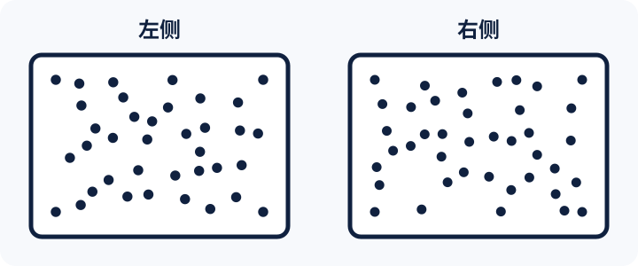

**选项：** A．左侧　B．右侧

**正确答案：** B

**标准推导：** 左右区域和分布边界相同，点半径按数量调整使总着色面积相同；内部计数为左37、右40，因此右侧更多。

**唯一答案检查：** 右侧比左侧多3个点；在总着色面积和边界控制后，只有右侧满足“点更多”。

**其他选项不成立：**

- A：左侧点更分散，若把覆盖范围当数量会误选。

#### N01-2

**学生端题目：** 哪一侧的点更多？
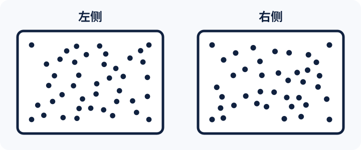

**选项：** A．左侧　B．右侧

**正确答案：** A

**标准推导：** 左右区域和分布边界相同，点半径按数量调整使总着色面积相同；内部计数为左42、右39，因此左侧更多。

**唯一答案检查：** 左侧比右侧多3个点；两侧不存在相同数量，答案唯一为左侧。

**其他选项不成立：**

- B：右侧局部更密，若只看局部疏密会误选。

### 04｜S01｜空间·识别结构

- 主要测量元能力：空间
- 对应二级能力：识别结构
- 可能同时调用：记忆
- 题型：embedded-structure
- 为什么能测目标能力：候选共享大量局部特征，只有追踪连接、转折与端点关系才能找到目标结构。
- 可能受其他能力影响：记忆（不作为本题主结论）
- 难度：基础
- 预计作答时间：28秒
- 知识依赖风险：低；不需要几何术语。
- 阅读依赖风险：低；主要信息由图形符号呈现。
- 题型经验风险：低；目标方向固定，规则简单。
- 任务计分：内部2次作答先求正确率，再折算为本任务1分
- 学生题干：哪张图里，藏着和目标图形完全一样的部分？

#### S01-1

**学生端题目：** 哪一项包含目标结构？
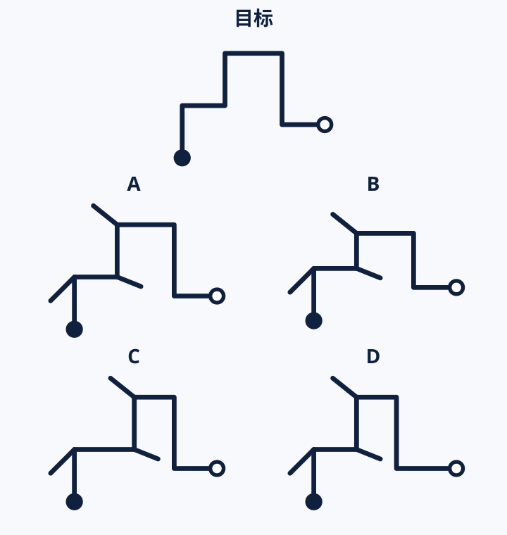

**选项：** A．A　B．B　C．C　D．D

**正确答案：** A

**标准推导：** 忽略支线后，从实心端到空心端，A保留目标的六段折线及各段长度关系。B改变上方高度，C改变中间横向位置，D改变右侧横向位置。

**唯一答案检查：** 忽略支线后，从实心端到空心端，A保留目标的六段折线及各段长度关系。B改变上方高度，C改变中间横向位置，D改变右侧横向位置。

**其他选项不成立：**

- B：上方两转折的高度改变。
- C：中间两转折的横向位置改变。
- D：右侧两转折的横向位置改变。

#### S01-2

**学生端题目：** 哪一项包含目标结构？
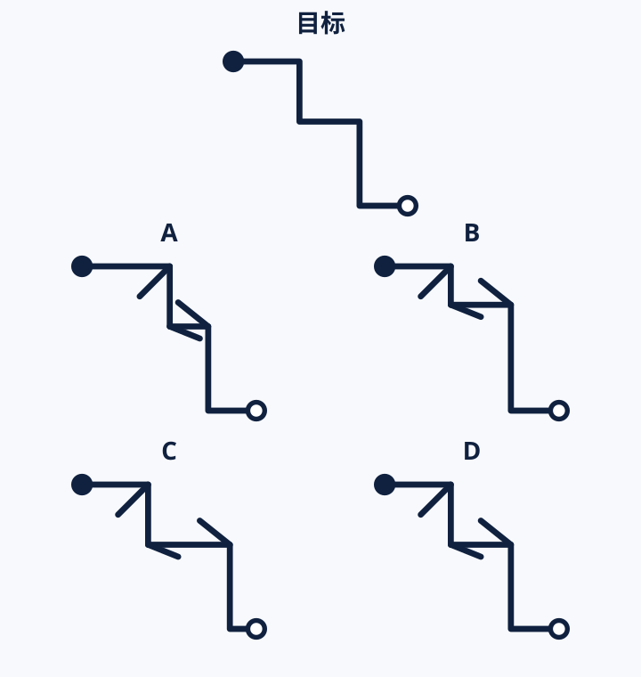

**选项：** A．A　B．B　C．C　D．D

**正确答案：** D

**标准推导：** D保留目标的五段折线路径和两种端点；其余候选各改变一组转折的位置，不能仅靠平移与目标重合。

**唯一答案检查：** D保留目标的五段折线路径和两种端点；其余候选各改变一组转折的位置，不能仅靠平移与目标重合。

**其他选项不成立：**

- A：第一组竖段向右偏移。
- B：中间横段向上偏移。
- C：第二组竖段向右偏移。

### 05｜R01｜推演·发现关系

- 主要测量元能力：推演
- 对应二级能力：发现关系
- 可能同时调用：空间
- 题型：graphic-analogy
- 为什么能测目标能力：新符号之间的对应只由示例给出，必须抽取关系并迁移到新对象，不能调用生活常识。
- 可能受其他能力影响：空间（不作为本题主结论）
- 难度：基础
- 预计作答时间：23秒
- 知识依赖风险：低；只使用简单图形属性。
- 阅读依赖风险：低；题干短。
- 题型经验风险：低；类比关系直接。
- 任务计分：内部2次作答先求正确率，再折算为本任务1分
- 学生题干：照着例子的变法，选出结果。

#### R01-1

**学生端题目：** A“○△”变为B“●△”；C“□◇”应变为？

**选项：** A．■◇　B．□◆　C．◇□　D．■■

**正确答案：** A

**标准推导：** A到B只把第一个空心图形填实；对C同样处理得到“■◇”。

**唯一答案检查：** 逐项代入题干条件后，仅正确项同时满足全部条件，其余选项各有一处明确冲突。

**其他选项不成立：**

- B：填实了第二个图形。
- C：交换了位置。
- D：把两个图形都改变了。

#### R01-2

**学生端题目：** 同一种变换把“▲○▲”变为“○▲○”，把“■◇■”变为“◇■◇”。“★□★”应变为？

**选项：** A．★□□　B．□★□　C．□□★　D．★□★

**正确答案：** B

**标准推导：** 两组示例都把两种符号的身份互换：原来外侧的符号变为内侧符号，原来内侧的符号变为外侧符号。★□★因此成为□★□。

**唯一答案检查：** 逐项代入题干条件后，仅正确项同时满足全部条件，其余选项各有一处明确冲突。

**其他选项不成立：**

- A：只替换末项，没有保持两外项一致。
- C：只替换首项，没有保持两外项一致。
- D：保持了原编码，未应用变换。

### 06｜M02｜记忆·快速记住

- 主要测量元能力：记忆
- 对应二级能力：快速记住
- 可能同时调用：语言
- 题型：semantic-pair-immediate
- 为什么能测目标能力：材料只呈现一次，随后立即撤去；正确作答必须保留新图形或虚构配对，而不能从常识补出答案。
- 可能受其他能力影响：语言（不作为本题主结论）
- 难度：基础
- 预计作答时间：21秒
- 知识依赖风险：低；对象名称和属性均为题内虚构。
- 阅读依赖风险：中；需要读懂简短属性词。
- 题型经验风险：低；采用直接配对选择。
- 任务计分：内部3次作答先求正确率，再折算为本任务1分
- 学生题干：名字和特点记忆：选出刚才看过的配对。

#### M02-1

**学生端题目：** “洛米”有什么特点？

**选项：** A．发蓝光　B．怕雨　C．会折叠　D．会变色

**正确答案：** A

**标准推导：** 语义材料中“洛米—发蓝光”，所以选择A。

**唯一答案检查：** 逐项代入题干条件后，仅正确项同时满足全部条件，其余选项各有一处明确冲突。

**其他选项不成立：**

- B：“怕雨”属于塔格。
- C：“会折叠”属于奈朴。
- D：“会变色”没有出现在材料中。

#### M02-2

**学生端题目：** “塔格”有什么特点？

**选项：** A．会折叠　B．发蓝光　C．怕雨　D．喜欢噪声

**正确答案：** C

**标准推导：** 语义材料中“塔格—怕雨”，所以选择C。

**唯一答案检查：** 逐项代入题干条件后，仅正确项同时满足全部条件，其余选项各有一处明确冲突。

**其他选项不成立：**

- A：“会折叠”属于奈朴。
- B：“发蓝光”属于洛米。
- D：“喜欢噪声”没有出现在材料中。

#### M02-3

**学生端题目：** “奈朴”有什么特点？

**选项：** A．怕雨　B．会折叠　C．会发香味　D．发蓝光

**正确答案：** B

**标准推导：** 语义材料中“奈朴—会折叠”，所以选择B。

**唯一答案检查：** 逐项代入题干条件后，仅正确项同时满足全部条件，其余选项各有一处明确冲突。

**其他选项不成立：**

- A：“怕雨”属于塔格。
- C：“会发香味”没有出现在材料中。
- D：“发蓝光”属于洛米。

### 07｜L02｜语言·理解意思

- 主要测量元能力：语言
- 对应二级能力：理解意思
- 可能同时调用：记忆
- 题型：reference-negation
- 为什么能测目标能力：选项系统改变对象、范围、否定或指代；只有准确理解原句边界才能排除近义误读。
- 可能受其他能力影响：记忆（不作为本题主结论）
- 难度：中等
- 预计作答时间：29秒
- 知识依赖风险：低；不要求外部知识。
- 阅读依赖风险：中；需要辨认代词、转折和否定范围。
- 题型经验风险：低；常规单选。
- 任务计分：内部2次作答先求正确率，再折算为本任务1分
- 学生题干：读这句话，选出理解正确的一项。

#### L02-1

**学生端题目：** “这篇评论保留了原来的判断，却换掉了支撑它的例子。作者说，这一调整是为了让说明更贴切，并不意味着撤回判断。”哪项理解准确？

**选项：** A．原判断被撤回，但原例子仍然保留　B．原判断暂不表态，先补充更多例子　C．原判断不变，支撑它的例子被替换　D．原例子不变，只修改了说明的措辞

**正确答案：** C

**标准推导：** “它”指原判断；“这一调整”指替换例子。改变的是支撑材料而非判断，C准确。

**唯一答案检查：** 逐项代入题干条件后，仅正确项同时满足全部条件，其余选项各有一处明确冲突。

**其他选项不成立：**

- A：对调了保留与替换的对象。
- B：把未撤回误读为暂不表态。
- D：将换例子缩小为改措辞。

#### L02-2

**学生端题目：** “两份说明都写清了报名步骤。前者把注意事项夹在步骤中，后者将其另列一栏。老师建议采用后者的编排，但沿用前者的措辞。”最终应怎样处理？

**选项：** A．将注意事项夹在步骤中，采用第二份的措辞　B．将注意事项另列一栏，采用第一份的措辞　C．将注意事项另列一栏，采用第二份的措辞　D．将注意事项夹在步骤中，采用第一份的措辞

**正确答案：** B

**标准推导：** 后者的编排是另列注意事项；前者的措辞是第一份的用语。B正确整合两处指代，不需要条件推导。

**唯一答案检查：** 逐项代入题干条件后，仅正确项同时满足全部条件，其余选项各有一处明确冲突。

**其他选项不成立：**

- A：把编排与措辞来源同时颠倒。
- C：只保留了编排要求，措辞来源错误。
- D：只保留了措辞要求，编排来源错误。

### 08｜N02｜数理·感知数量

- 主要测量元能力：数理
- 对应二级能力：感知数量
- 可能同时调用：空间
- 题型：number-line-estimation
- 为什么能测目标能力：题目控制或隐藏精确数值，要求比较整体数量或连续位置；不能靠已学公式直接求解。
- 可能受其他能力影响：空间（不作为本题主结论）
- 难度：基础
- 预计作答时间：24秒
- 知识依赖风险：低；只涉及端点、基准刻度与目标数。
- 阅读依赖风险：低；题干短。
- 题型经验风险：中；需要把数值映射到连续位置，不能依赖选点精确数值。
- 任务计分：内部2次作答先求正确率，再折算为本任务1分
- 学生题干：数轴上，哪个点最接近题目给出的数？

#### N02-1

**学生端题目：** 图中哪个点最接近57？
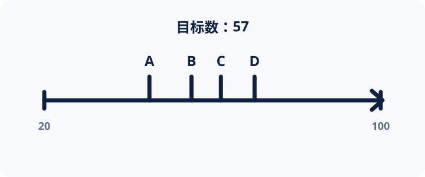

**选项：** A．A　B．B　C．C　D．D

**正确答案：** B

**标准推导：** 数轴范围20至100，四点内部位置为45、55、62、70，与57的距离为12、2、5、13，只有B最近。

**唯一答案检查：** 数轴范围20至100，四点内部位置为45、55、62、70，与57的距离为12、2、5、13，只有B最近。

**其他选项不成立：**

- A：低估目标位置。
- C：高估目标位置。
- D：高估目标，忽略左端不是0。

#### N02-2

**学生端题目：** 图中哪个点最接近109？
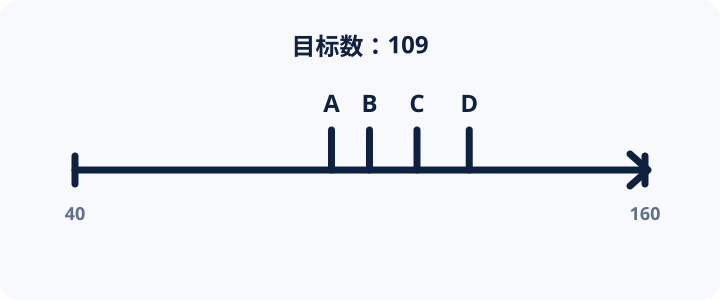

**选项：** A．A　B．B　C．C　D．D

**正确答案：** C

**标准推导：** 数轴范围40至160，四点内部位置为94、102、112、123，与109的距离为15、7、3、14，只有C最近。

**唯一答案检查：** 数轴范围40至160，四点内部位置为94、102、112、123，与109的距离为15、7、3、14，只有C最近。

**其他选项不成立：**

- A：低估目标位置。
- B：低估目标与左端的距离。
- D：高估目标位置。

### 09｜S02｜空间·识别结构

- 主要测量元能力：空间
- 对应二级能力：识别结构
- 可能同时调用：推演
- 题型：structure-completion
- 为什么能测目标能力：候选共享大量局部特征，只有追踪连接、转折与端点关系才能找到目标结构。
- 可能受其他能力影响：推演（不作为本题主结论）
- 难度：中等
- 预计作答时间：32秒
- 知识依赖风险：低；不需电路知识，只按接通规则。
- 阅读依赖风险：低；规则说明一句话。
- 题型经验风险：中；补线符号首次出现，提供规则说明。
- 任务计分：内部2次作答先求正确率，再折算为本任务1分
- 学生题干：空格里放哪一块，能把粗线接通？

#### S02-1

**学生端题目：** 哪一块能同时接通三对相同标记？
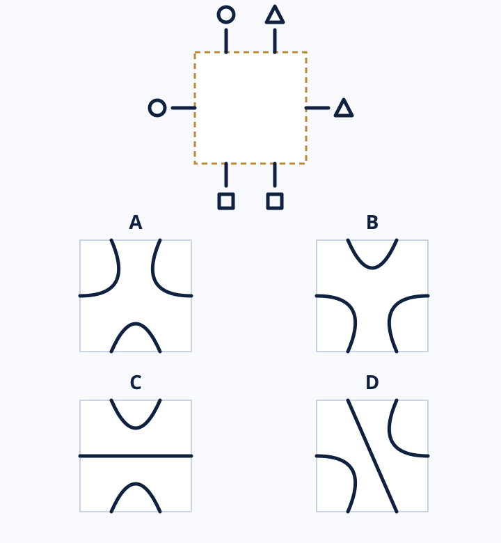

**选项：** A．A　B．B　C．C　D．D

**正确答案：** A

**标准推导：** 从上方左接口顺时针将六接口编号0至5（仅审计用），目标配对为0—5、1—2、3—4。只有A同时满足三对，且三路相互独立。

**唯一答案检查：** 从上方左接口顺时针将六接口编号0至5（仅审计用），目标配对为0—5、1—2、3—4。只有A同时满足三对，且三路相互独立。

**其他选项不成立：**

- B：将上方两个不同标记接在一起。
- C：将上方两个不同标记接在一起。
- D：将接口0接到3，圆标记与另一类标记混接。

#### S02-2

**学生端题目：** 哪一块能同时接通三对相同标记？
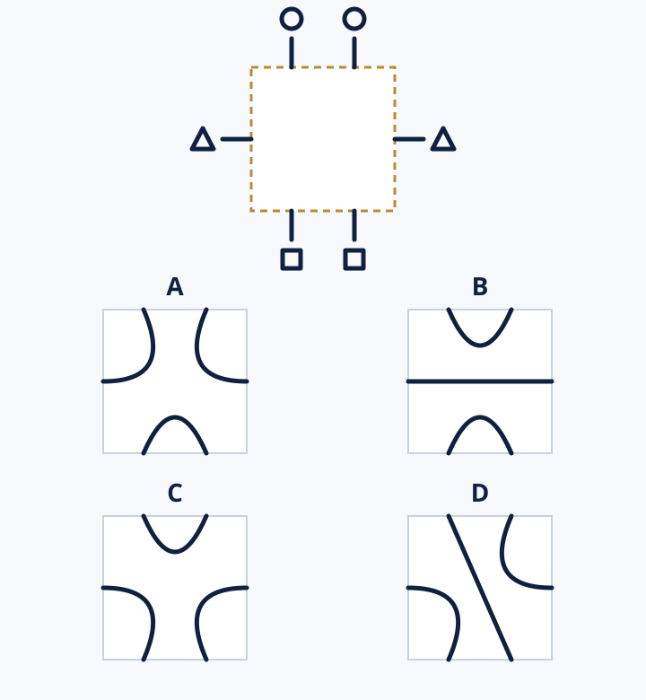

**选项：** A．A　B．B　C．C　D．D

**正确答案：** B

**标准推导：** 按同一顺时针内部编号，目标配对为0—1、2—5、3—4。只有B保持全部三对标记分别接通。

**唯一答案检查：** 按同一顺时针内部编号，目标配对为0—1、2—5、3—4。只有B保持全部三对标记分别接通。

**其他选项不成立：**

- A：将接口0接到5，混接不同标记。
- C：将接口2接到3，混接不同标记。
- D：将接口0接到3，混接不同标记。

### 10｜R02｜推演·发现关系

- 主要测量元能力：推演
- 对应二级能力：发现关系
- 可能同时调用：数理
- 题型：minimal-symbol-relation
- 为什么能测目标能力：新符号之间的对应只由示例给出，必须抽取关系并迁移到新对象，不能调用生活常识。
- 可能受其他能力影响：数理（不作为本题主结论）
- 难度：中等
- 预计作答时间：28秒
- 知识依赖风险：低；符号关系在题内定义。
- 阅读依赖风险：低；文字负担很低。
- 题型经验风险：中；需要保持映射方向。
- 任务计分：内部2次作答先求正确率，再折算为本任务1分
- 学生题干：看例子里的符号怎么变，再照样变一变。

#### R02-1

**学生端题目：** 同一种变换把“△○□”变为“□△○”，把“◇★■”变为“■◇★”。“＋●▽”连续经过两次该变换，得到？

**选项：** A．▽＋●　B．▽●＋　C．●▽＋　D．＋●▽

**正确答案：** C

**标准推导：** 每次把末项移到首位，保留另外两项的次序。＋●▽第一次成为▽＋●，第二次成为●▽＋。

**唯一答案检查：** 逐项代入题干条件后，仅正确项同时满足全部条件，其余选项各有一处明确冲突。

**其他选项不成立：**

- A：只执行了一次变换。
- B：把原顺序倒置。
- D：执行了三次而非两次。

#### R02-2

**学生端题目：** 同一种变换把“◇★■●”变为“★◇●■”，把“▲○□＋”变为“○▲＋□”。“▽◆◎△”经过该变换，得到？

**选项：** A．△▽◆◎　B．◆▽△◎　C．◎△▽◆　D．△◎◆▽

**正确答案：** B

**标准推导：** 关系是第1、2项互换，同时第3、4项互换；▽◆◎△因此成为◆▽△◎。

**唯一答案检查：** 逐项代入题干条件后，仅正确项同时满足全部条件，其余选项各有一处明确冲突。

**其他选项不成立：**

- A：把末项移到开头。
- C：交换两对的整体位置而非对内位置。
- D：将整个序列倒置。

### 11｜L03｜语言·组织信息

- 主要测量元能力：语言
- 对应二级能力：组织信息
- 可能同时调用：推演
- 题型：information-order
- 为什么能测目标能力：句子内容相同但顺序不同；必须依据因果、转折和指代把信息组织成连贯结构。
- 可能受其他能力影响：推演（不作为本题主结论）
- 难度：基础
- 预计作答时间：24秒
- 知识依赖风险：低；内容为一般说明。
- 阅读依赖风险：低；短句结构明确。
- 题型经验风险：低；顺序选择前有清楚编号。
- 任务计分：内部2次作答先求正确率，再折算为本任务1分
- 学生题干：把几句话排成通顺的一段。

#### L03-1

**学生端题目：** ①这张清单随后交给管理员。②核对后，管理员把两处遗漏补进清单。③小岑先按登记表列出缺书清单。④管理员收到后，逐项核对登记表。

**选项：** A．③①④②　B．③④①②　C．①③④②　D．③①②④

**正确答案：** A

**标准推导：** ③先生成清单，①随后交出；④收到后核对，②“核对后”承接核对并补漏。

**唯一答案检查：** 逐项代入题干条件后，仅正确项同时满足全部条件，其余选项各有一处明确冲突。

**其他选项不成立：**

- B：管理员核对先于收到，违反④的时间限定。
- C：“这张清单”在生成前出现。
- D：“核对后”的补漏被排在核对之前。

#### L03-2

**学生端题目：** ①她把这三条信息合并成一句提示。②压缩后的提示随后贴在门口。③小夏先记下开放时间、入口和预约要求。④贴出后，她又在末尾补上联系电话。

**选项：** A．③②①④　B．①③②④　C．③①②④　D．③①④②

**正确答案：** C

**标准推导：** ③提供三条信息，①的“这三条”回指它们；②“压缩后的”承接合并，④“贴出后”承接张贴。

**唯一答案检查：** 逐项代入题干条件后，仅正确项同时满足全部条件，其余选项各有一处明确冲突。

**其他选项不成立：**

- A：张贴发生在合并之前。
- B：“这三条”缺少前文对象。
- D：补电话发生在“贴出”之前，违反④。

### 12｜N03｜数理·理解变化

- 主要测量元能力：数理
- 对应二级能力：理解变化
- 可能同时调用：推演
- 题型：observed-change-comparison
- 为什么能测目标能力：答案由相邻变化或两个量的共同变化决定；只看单个数值无法完成。
- 可能受其他能力影响：推演（不作为本题主结论）
- 难度：中等
- 预计作答时间：30秒
- 知识依赖风险：低；只用小整数加减。
- 阅读依赖风险：低；题干简短。
- 题型经验风险：中；需识别折线、等间隔记录和相邻增量，图表经验可能影响表现。
- 任务计分：内部2次作答先求正确率，再折算为本任务1分
- 学生题干：看图，比较甲、乙两组怎样变化。

#### N03-1

**学生端题目：** 图中各次记录的间隔相同。关于甲、乙相邻两次的增加量，哪项正确？
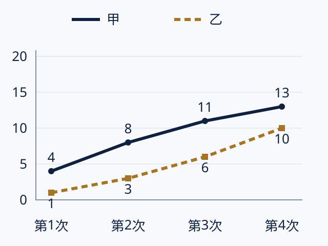

**选项：** A．甲逐次增大，乙逐次减小　B．甲保持不变，乙逐次增大　C．甲逐次减小，乙逐次增大　D．甲逐次减小，乙保持不变

**正确答案：** C

**标准推导：** 甲为4、8、11、13，增加量为4、3、2，逐次减小；乙为1、3、6、10，增加量为2、3、4，逐次增大。

**唯一答案检查：** 逐段计算两组增加量，仅C同时描述正确；只比较最终数值无法得到答案。

**其他选项不成立：**

- A：颠倒了两组增加量的变化方向。
- B：甲的增加量并不恒定。
- D：乙的增加量并不恒定。

#### N03-2

**学生端题目：** 哪项同时准确描述了两组的增加量和两组之间的差距？
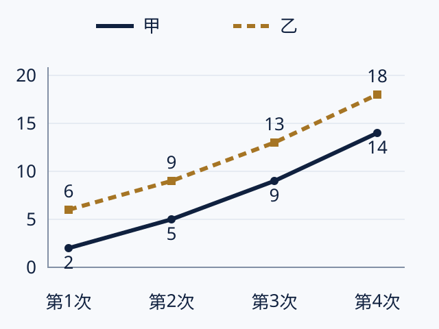

**选项：** A．甲每段增加更多，差距逐次缩小　B．两组每段增加相同，差距保持不变　C．乙每段增加更多，差距逐次扩大　D．两组每段增加相同，差距逐次缩小

**正确答案：** B

**标准推导：** 甲2、5、9、14，乙6、9、13、18；两组各段增加量都为3、4、5，每次记录乙都比甲多4，因此增量相同而差距不变。

**唯一答案检查：** 比较三段增量与四个时点差距，仅B同时满足。

**其他选项不成立：**

- A：两组增量相同，并非甲更多。
- C：乙数值始终更高不代表乙的增量更大。
- D：相同增量不会缩小两组差距。

### 13｜S03｜空间·空间想象

- 主要测量元能力：空间
- 对应二级能力：空间想象
- 可能同时调用：记忆
- 题型：rotation-not-mirror
- 为什么能测目标能力：目标结果不可直接从文字读出，必须在头脑中完成旋转或拼合，再与可视化候选核对。
- 可能受其他能力影响：记忆（不作为本题主结论）
- 难度：基础
- 预计作答时间：30秒
- 知识依赖风险：低；不需学科知识。
- 阅读依赖风险：低；说明短。
- 题型经验风险：中；需要区分旋转与镜像，提供规则说明。
- 任务计分：内部2次作答先求正确率，再折算为本任务1分
- 学生题干：哪一项转动后，和目标图形完全一样？

#### S03-1

**学生端题目：** 哪一项能由目标只旋转得到？
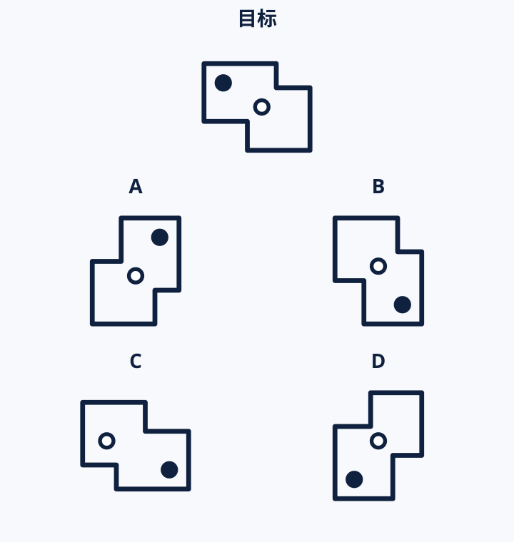

**选项：** A．A　B．B　C．C　D．D

**正确答案：** A

**标准推导：** A是目标顺时针旋转90°后的结果，凹口、长短边与实心／空心标记的相对位置均保持不变。

**唯一答案检查：** A是目标顺时针旋转90°后的结果，凹口、长短边与实心／空心标记的相对位置均保持不变。

**其他选项不成立：**

- B：包含镜像翻面，无法只旋转得到。
- C：空心标记相对外轮廓的位置改变。
- D：凹口对应的两顶点位置改变。

#### S03-2

**学生端题目：** 哪一项能由目标只旋转得到？
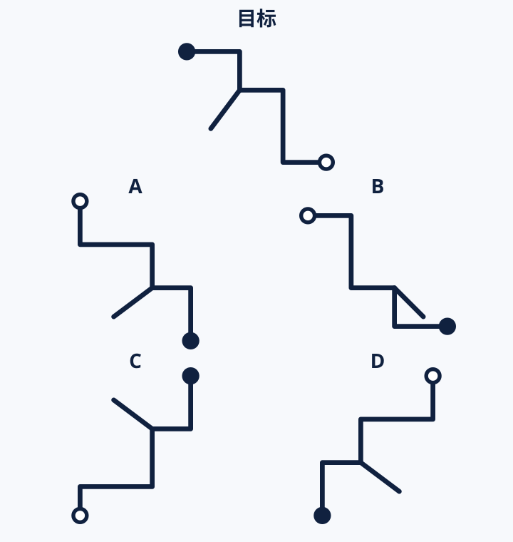

**选项：** A．A　B．B　C．C　D．D

**正确答案：** D

**标准推导：** D是目标顺时针旋转270°后的结果，全部折线、分支与实心／空心端点同时对应。

**唯一答案检查：** D是目标顺时针旋转270°后的结果，全部折线、分支与实心／空心端点同时对应。

**其他选项不成立：**

- A：包含镜像翻面。
- B：分支朝向被改变。
- C：一组转折位置改变，不是刚体旋转。

### 14｜R03｜推演·归纳规律

- 主要测量元能力：推演
- 对应二级能力：归纳规律
- 可能同时调用：数理
- 题型：graphic-sequence
- 为什么能测目标能力：下一项未直接给出，必须从连续实例中归纳稳定变换；干扰项对应只跟踪局部特征的错误。
- 可能受其他能力影响：数理（不作为本题主结论）
- 难度：基础
- 预计作答时间：26秒
- 知识依赖风险：低；规则只作用于题内符号。
- 阅读依赖风险：低；题干极短。
- 题型经验风险：中；需要从多个表面变化中识别同一个稳定变换。
- 任务计分：内部2次作答先求正确率，再折算为本任务1分
- 学生题干：选择最符合已有变化规律的下一项。

#### R03-1

**学生端题目：** ○△□◇，△□◇○，□◇○△，下一项是？

**选项：** A．◇△□○　B．○△□◇　C．◇○△□　D．△○◇□

**正确答案：** C

**标准推导：** 每次将首项移到末尾，其余顺序不变。第三组继续左移一项，得到◇○△□。

**唯一答案检查：** 逐项代入题干条件后，仅正确项同时满足全部条件，其余选项各有一处明确冲突。

**其他选项不成立：**

- A：虽以菱形开头，但其余顺序不符。
- B：提前回到第一组。
- D：将位置作了不同的成对交换。

#### R03-2

**学生端题目：** ●○○●○，○●○○●，●○●○○，下一项是？

**选项：** A．○●○●○　B．○○●○●　C．●○○●○　D．○●●○○

**正确答案：** A

**标准推导：** 每一步所有符号向右循环移动一位，末项移到首位。第三组移动后得到○●○●○。

**唯一答案检查：** 逐项代入题干条件后，仅正确项同时满足全部条件，其余选项各有一处明确冲突。

**其他选项不成立：**

- B：移动两位而不是一位。
- C：移动三位而不是一位。
- D：只移动了其中一个实心圆。

### 15｜M03｜记忆·保持信息

- 主要测量元能力：记忆
- 对应二级能力：保持信息
- 可能同时调用：语言
- 题型：sequence-recall-4-5
- 为什么能测目标能力：目标信息在作答时不再可见，并经过其他任务或较长间隔；得分取决于能否保持指定内容而非重新辨认材料。
- 可能受其他能力影响：语言（不作为本题主结论）
- 难度：中等
- 预计作答时间：28秒
- 知识依赖风险：低；只需记住题内符号。
- 阅读依赖风险：低；几乎没有阅读负担。
- 题型经验风险：中；需要理解序列整体选择方式，题前说明会介绍。
- 任务计分：内部2次作答先求正确率，再折算为本任务1分
- 学生题干：两组符号记忆：回想原来的顺序。

#### M03-1

**学生端题目：** 四项序列的原顺序是？

**选项：** A．◆ ○ ▲ ■　B．◆ ▲ ○ ■　C．○ ◆ ▲ ■　D．◆ ○ ■ ▲

**正确答案：** A

**标准推导：** 材料按“◆、○、▲、■”依次出现，A完整保持了位置顺序。

**唯一答案检查：** 逐项代入题干条件后，仅正确项同时满足全部条件，其余选项各有一处明确冲突。

**其他选项不成立：**

- B：交换了第2、3项。
- C：交换了第1、2项。
- D：交换了第3、4项。

#### M03-2

**学生端题目：** 五项序列的原顺序是？

**选项：** A．☂ ◇ ☀ ♧ ★　B．◇ ☂ ☀ ♧ ★　C．☂ ◇ ♧ ☀ ★　D．☂ ◇ ☀ ★ ♧

**正确答案：** A

**标准推导：** 材料按“☂、◇、☀、♧、★”依次出现，A与原序列一致。

**唯一答案检查：** 逐项代入题干条件后，仅正确项同时满足全部条件，其余选项各有一处明确冲突。

**其他选项不成立：**

- B：交换了第1、2项。
- C：交换了第3、4项。
- D：交换了第4、5项。

### 16｜L04｜语言·组织信息

- 主要测量元能力：语言
- 对应二级能力：组织信息
- 可能同时调用：推演
- 题型：paragraph-coherence
- 为什么能测目标能力：句子内容相同但顺序不同；必须依据因果、转折和指代把信息组织成连贯结构。
- 可能受其他能力影响：推演（不作为本题主结论）
- 难度：挑战
- 预计作答时间：34秒
- 知识依赖风险：低；不需要学科知识。
- 阅读依赖风险：中；需要同时追踪指代与因果。
- 题型经验风险：中；四句排序需要一定题型熟悉度。
- 任务计分：内部2次作答先求正确率，再折算为本任务1分
- 学生题干：把四句话排成一段，前后要接得上。

#### L04-1

**学生端题目：** ①因此，管理员增加了晚间归还点。②调查发现晚间还书者最多。③这项调整试行一周后，排队时间缩短。④图书馆记录了不同时段的还书人数。

**选项：** A．④②①③　B．②④③①　C．④①②③　D．①③④②

**正确答案：** A

**标准推导：** 先记录④，再得到发现②，因此调整①，最后“这项调整”承接并给出结果③。

**唯一答案检查：** 逐项代入题干条件后，仅正确项同时满足全部条件，其余选项各有一处明确冲突。

**其他选项不成立：**

- B：调查结论出现在记录之前，且结果早于调整。
- C：未先说明发现就调整。
- D：以“因此”开头却没有前因。

#### L04-2

**学生端题目：** ①这说明原来的解释还不完整。②研究者先提出温度会影响结果。③但在温度不变时，结果仍然波动。④他们随后加入了湿度记录。

**选项：** A．②③①④　B．③②④①　C．②①③④　D．④②③①

**正确答案：** A

**标准推导：** 先提出解释②，再用转折证据③挑战它，由此得出①，随后采取④。

**唯一答案检查：** 逐项代入题干条件后，仅正确项同时满足全部条件，其余选项各有一处明确冲突。

**其他选项不成立：**

- B：转折事实出现在被反驳的解释之前。
- C：“这”没有可指代的前文证据。
- D：先记录湿度再提出原解释，时间关系不自然。

### 17｜N04｜数理·理解变化

- 主要测量元能力：数理
- 对应二级能力：理解变化
- 可能同时调用：推演
- 题型：covariation
- 为什么能测目标能力：答案由相邻变化或两个量的共同变化决定；只看单个数值无法完成。
- 可能受其他能力影响：推演（不作为本题主结论）
- 难度：中等
- 预计作答时间：28秒
- 知识依赖风险：低；不依赖公式。
- 阅读依赖风险：中；需要读懂两列量的变化。
- 题型经验风险：低；表格关系直接呈现。
- 任务计分：内部2次作答先求正确率，再折算为本任务1分
- 学生题干：比较两个量怎样一起变化。

#### N04-1

**学生端题目：** 甲每增加2，乙就减少3，始终如此。甲从4变到8时，乙从11变到多少？

**选项：** A．5　B．8　C．6　D．17

**正确答案：** A

**标准推导：** 甲增加4，相当于两次增加2，乙应减少两次3，即6；11−6＝5。

**唯一答案检查：** 逐项代入题干条件后，仅正确项同时满足全部条件，其余选项各有一处明确冲突。

**其他选项不成立：**

- B：只减少了一次3。
- C：算出变化量6，却未求最终值。
- D：把减少方向误作增加。

#### N04-2

**学生端题目：** 每轮甲增加2、乙减少1，始终如此。开始甲为3、乙为8；两轮后甲比乙多多少？

**选项：** A．1　B．3　C．5　D．7

**正确答案：** A

**标准推导：** 两轮后甲为3+4＝7，乙为8−2＝6，甲比乙多1。

**唯一答案检查：** 逐项代入题干条件后，仅正确项同时满足全部条件，其余选项各有一处明确冲突。

**其他选项不成立：**

- B：将每轮差距变化3当成最终差距。
- C：沿用开始的差距5。
- D：只算出甲的最终数值。

### 18｜S04｜空间·空间想象

- 主要测量元能力：空间
- 对应二级能力：空间想象
- 可能同时调用：推演
- 题型：shape-composition
- 为什么能测目标能力：目标结果不可直接从文字读出，必须在头脑中完成旋转或拼合，再与可视化候选核对。
- 可能受其他能力影响：推演（不作为本题主结论）
- 难度：中等
- 预计作答时间：35秒
- 知识依赖风险：低；只涉及方格拼合。
- 阅读依赖风险：低；文字少，以方块图示为主。
- 题型经验风险：中；拼合规则首次出现，提供规则说明。
- 任务计分：内部2次作答先求正确率，再折算为本任务1分
- 学生题干：两块图形沿金边拼好后，外轮廓是什么样？

#### S04-1

**学生端题目：** 保持左块方向，拼好后的外轮廓是哪一项？
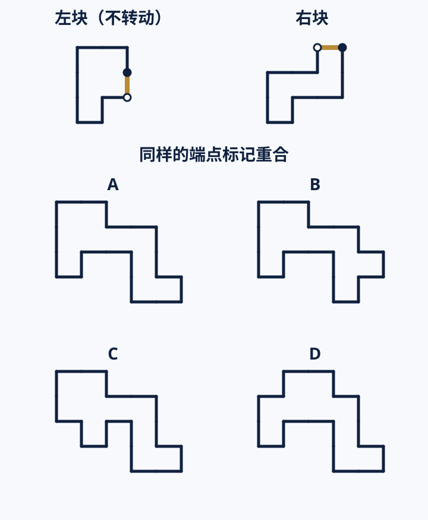

**选项：** A．A　B．B　C．C　D．D

**正确答案：** A

**标准推导：** 把右块转回金边与左块同向、同类端点重合的位置，再沿金边贴合。两块各占5个等大方格，合成10格无重叠轮廓，只有A匹配全部外边界。

**唯一答案检查：** 把右块转回金边与左块同向、同类端点重合的位置，再沿金边贴合。两块各占5个等大方格，合成10格无重叠轮廓，只有A匹配全部外边界。

**其他选项不成立：**

- B：右下末端高了一格。
- C：左侧底端的伸出位置改变。
- D：左上方格的位置改变。

#### S04-2

**学生端题目：** 保持左块方向，拼好后的外轮廓是哪一项？
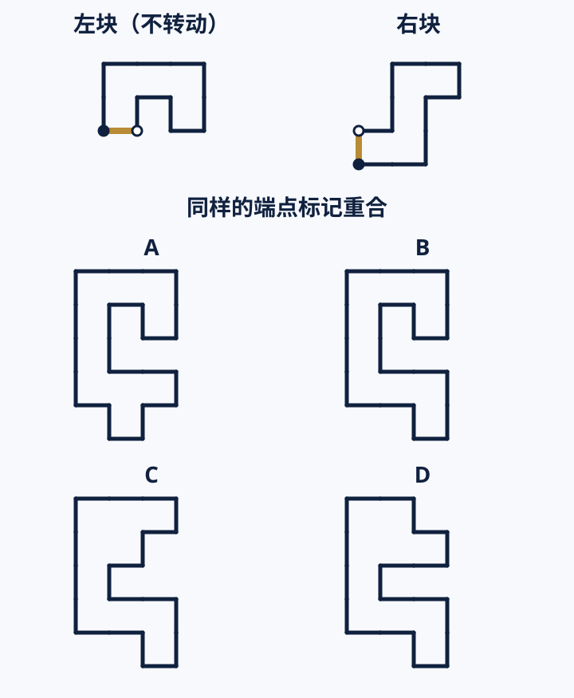

**选项：** A．A　B．B　C．C　D．D

**正确答案：** B

**标准推导：** 先旋转右块使金边端点与左块逐一对应，再平移贴合。所得10格轮廓上方保留左块缺口、下方保留右块弯折，只有B完整保留。

**唯一答案检查：** 先旋转右块使金边端点与左块逐一对应，再平移贴合。所得10格轮廓上方保留左块缺口、下方保留右块弯折，只有B完整保留。

**其他选项不成立：**

- A：底端向左偏移了一格。
- C：把左块的缺口位置改变。
- D：把左块右上方格移入缺口。

### 19｜R04｜推演·归纳规律

- 主要测量元能力：推演
- 对应二级能力：归纳规律
- 可能同时调用：数理
- 题型：dual-rule-symbol-pattern
- 为什么能测目标能力：下一项未直接给出，必须从连续实例中归纳稳定变换；干扰项对应只跟踪局部特征的错误。
- 可能受其他能力影响：数理（不作为本题主结论）
- 难度：挑战
- 预计作答时间：38秒
- 知识依赖风险：低；只用题内形状与小整数。
- 阅读依赖风险：低；规则说明短。
- 题型经验风险：中；需要把形状循环与数值变化拆开追踪，不能靠单一表面相似。
- 任务计分：内部2次作答先求正确率，再折算为本任务1分
- 学生题干：每组包含形状和数字。选择符合整组规律的下一项。

#### R04-1

**学生端题目：** ○2，△5，□4，○7，△6，□9，○8，下一项是？

**选项：** A．△9　B．□11　C．□9　D．△11

**正确答案：** D

**标准推导：** 规则一：形状以○△□为周期重复，下一项为△。规则二：数字的变化为+3、−1交替，三轮均符合，8之后为11；两条规则合并得到△11。

**唯一答案检查：** 检查最短重复形状周期与交替增量，两条规则同时适合全部已给项；在四个选项中仅D满足。此检查不宣称任意有限序列只有一种数学延拓。

**其他选项不成立：**

- A：形状符合，但数字误按+1。
- B：数字符合，但形状跳过△。
- C：两条规则都不符合。

#### R04-2

**学生端题目：** ◇3，○6，△4，◇8，○6，△11，◇9，下一项是？

**选项：** A．△15　B．○14　C．○15　D．△14

**正确答案：** C

**标准推导：** 规则一：形状以◇○△为周期重复，下一项为○。规则二：增量为+3、−2、+4、−2、+5、−2，正增量每次多1，负增量固定−2；下一次+6，9变为15，因此是○15。

**唯一答案检查：** 形状最短周期3；交替增量中正增量等差递增、负增量固定。全部已给项共同支持这组规则，四个候选中仅C满足；不是任意规则空间中的绝对唯一证明。

**其他选项不成立：**

- A：数字符合，但形状跳过○。
- B：形状符合，但沿用了前一次正增量+5。
- D：形状错位且未更新正增量。

### 20｜M04｜记忆·保持信息

- 主要测量元能力：记忆
- 对应二级能力：保持信息
- 可能同时调用：语言
- 题型：semantic-pair-delayed
- 为什么能测目标能力：目标信息在作答时不再可见，并经过其他任务或较长间隔；得分取决于能否保持指定内容而非重新辨认材料。
- 可能受其他能力影响：语言（不作为本题主结论）
- 难度：中等
- 预计作答时间：24秒
- 知识依赖风险：低；全部信息在测评内提供。
- 阅读依赖风险：中；需要理解简短属性。
- 题型经验风险：低；采用直接配对选择。
- 任务计分：内部3次作答先求正确率，再折算为本任务1分
- 学生题干：名字和特点记忆：找回原来的配对。

#### M04-1

**学生端题目：** “西岚”有什么特点？

**选项：** A．晚上发热　B．靠近水会变轻　C．会折叠　D．怕雨

**正确答案：** B

**标准推导：** 开场语义材料中“西岚—靠近水会变轻”，所以选择B。

**唯一答案检查：** 逐项代入题干条件后，仅正确项同时满足全部条件，其余选项各有一处明确冲突。

**其他选项不成立：**

- A：“晚上发热”属于伏可。
- C：“会折叠”属于即时子集奈朴。
- D：“怕雨”属于即时子集塔格。

#### M04-2

**学生端题目：** “伏可”有什么特点？

**选项：** A．碰金属会响　B．发蓝光　C．晚上发热　D．靠近水会变轻

**正确答案：** C

**标准推导：** 开场语义材料中“伏可—晚上发热”，所以选择C。

**唯一答案检查：** 逐项代入题干条件后，仅正确项同时满足全部条件，其余选项各有一处明确冲突。

**其他选项不成立：**

- A：“碰金属会响”属于墨迩。
- B：“发蓝光”属于即时子集洛米。
- D：“靠近水会变轻”属于西岚。

#### M04-3

**学生端题目：** “墨迩”有什么特点？

**选项：** A．碰金属会响　B．怕雨　C．晚上发热　D．发蓝光

**正确答案：** A

**标准推导：** 开场语义材料中“墨迩—碰金属会响”，所以选择A。

**唯一答案检查：** 逐项代入题干条件后，仅正确项同时满足全部条件，其余选项各有一处明确冲突。

**其他选项不成立：**

- B：“怕雨”属于即时子集塔格。
- C：“晚上发热”属于伏可。
- D：“发蓝光”属于即时子集洛米。

### 21｜L05｜语言·准确表达

- 主要测量元能力：语言
- 对应二级能力：准确表达
- 可能同时调用：推演
- 题型：scope-preservation
- 为什么能测目标能力：各选项共享主题但在范围、指代或执行信息上有细微差异；作答要求辨认表达是否完整准确。
- 可能受其他能力影响：推演（不作为本题主结论）
- 难度：中等
- 预计作答时间：28秒
- 知识依赖风险：低；只需比较句意范围。
- 阅读依赖风险：中；需要识别“多数、可能、仅”等限定。
- 题型经验风险：低；常规单选。
- 任务计分：内部2次作答先求正确率，再折算为本任务1分
- 学生题干：哪种改写不漏条件，也不多加意思？

#### L05-1

**学生端题目：** 原句：“目前仅能确认部分样本改善，尚不能确定改善能否持续。”

**选项：** A．部分样本已改善，而且改善能够持续　B．仅有部分样本改善，其余样本均未改善　C．全部样本可能改善，但改善不能持续　D．已确认部分样本改善，能否持续仍待确认

**正确答案：** D

**标准推导：** 原句只确认部分样本改善，对其他样本和持续性都没有下定论。

**唯一答案检查：** 逐项代入题干条件后，仅正确项同时满足全部条件，其余选项各有一处明确冲突。

**其他选项不成立：**

- A：加入肯定的持续性结论。
- B：把仅能确认的范围误成全部样本的结论。
- C：改变样本范围，并断言不能持续。

#### L05-2

**学生端题目：** 原句：“本批只接收周四前提交的完整材料；已提交的不完整材料，可在周三补齐后纳入本批。”

**选项：** A．周四前提交均进本批，缺件可以以后补齐　B．周四前交齐可进本批，已交缺件可周三补齐　C．周四前交齐可进本批，已交缺件只能转下批　D．周四当天交齐进本批，已交缺件可周三补齐

**正确答案：** B

**标准推导：** B保留“周四前且完整”的接收范围，以及已提交缺件材料在周三补齐的补救安排。

**唯一答案检查：** 逐项代入题干条件后，仅正确项同时满足全部条件，其余选项各有一处明确冲突。

**其他选项不成立：**

- A：删除完整要求并延长补齐时间。
- C：删除允许补齐后纳入的安排。
- D：将周四前改成周四当天。

### 22｜N05｜数理·处理符号

- 主要测量元能力：数理
- 对应二级能力：处理符号
- 可能同时调用：推演
- 题型：novel-symbol-rule
- 为什么能测目标能力：符号含义完全在题内定义，必须保持并执行新规则；熟悉的运算符经验不能直接替代。
- 可能受其他能力影响：推演（不作为本题主结论）
- 难度：中等
- 预计作答时间：30秒
- 知识依赖风险：低；规则在题内给出，只用小整数。
- 阅读依赖风险：低；符号定义一句话。
- 题型经验风险：中；新符号题型需要先理解定义。
- 任务计分：内部2次作答先求正确率，再折算为本任务1分
- 学生题干：按下面的规则，选出数量对得上的一项。

#### N05-1

**学生端题目：** 按规则，哪种编码表示11？

**选项：** A．左2个●，右3个●　B．左3个●，右2个●　C．左4个●，右1个●　D．左1个●，右4个●

**正确答案：** B

**标准推导：** 左格每点表示3、右格每点表示1。各项依次为9、11、13、7，B表示11。四项均有5点，不能只比较总点数。

**唯一答案检查：** 逐项代入题干条件后，仅正确项同时满足全部条件，其余选项各有一处明确冲突。

**其他选项不成立：**

- A：低估左格所需点数。
- C：高估左格所需点数。
- D：把数量分配到权重较低的右格。

#### N05-2

**学生端题目：** “左2个●、右3个●”与哪种编码表示相同的数量？

**选项：** A．左1个●，右4个●　B．左2个●，右2个●　C．左3个●，右0个●　D．左3个●，右1个●

**正确答案：** C

**标准推导：** 原编码表示2×3＋3＝9；四项表示7、8、9、10。把右侧3点换为左侧1点得到C。

**唯一答案检查：** 逐项代入题干条件后，仅正确项同时满足全部条件，其余选项各有一处明确冲突。

**其他选项不成立：**

- A：误把左右各一点视为等值。
- B：漏算右侧一个点。
- D：换成左侧一点后仍多保留右侧一点。

### 23｜S05｜空间·空间转换

- 主要测量元能力：空间
- 对应二级能力：空间转换
- 可能同时调用：推演
- 题型：net-folding
- 为什么能测目标能力：必须把平面图转换成立体关系，或对图示位置执行方向变换；答案取决于变换后的相对位置。
- 可能受其他能力影响：推演（不作为本题主结论）
- 难度：挑战
- 预计作答时间：34秒
- 知识依赖风险：低；只需按题内展开图判断。
- 阅读依赖风险：低；图示和问题都简短。
- 题型经验风险：中；展开图题型经验可能影响表现，提供规则说明。
- 任务计分：内部2次作答先求正确率，再折算为本任务1分
- 学生题干：把图折成正方体后，哪两个面正好相对？

#### S05-1

**学生端题目：** 折成立方体后，与C相对的是？
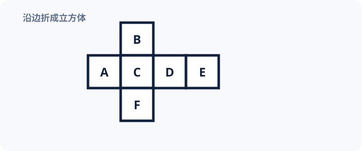

**选项：** A．A　B．B　C．E　D．F

**正确答案：** C

**标准推导：** 以C为正面，A、D、B、F折成四个侧面；接在D外侧的E折到C背面，所以C与E相对。

**唯一答案检查：** 按共享边折叠后，E的法向与C相反；A、B、F均与C共享棱，唯一答案为E。

**其他选项不成立：**

- A：A与C相邻。
- B：B与C相邻。
- D：F与C相邻。

#### S05-2

**学生端题目：** 这张展开图折起后，哪两面相对？
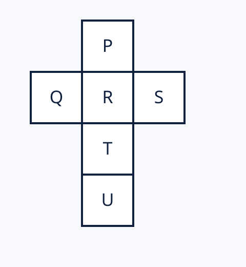

**选项：** A．P与R　B．R与T　C．S与U　D．Q与S

**正确答案：** D

**标准推导：** 以R为正面折起，Q与S分别位于左、右两面，法向相反；P与T相对，R与U相对。

**唯一答案检查：** 六面折叠法向产生三对相对面Q/S、P/T、R/U，四个候选中仅D属于其中一对。

**其他选项不成立：**

- A：P与R共边。
- B：R与T共边。
- C：S与U折起后相邻。

### 24｜R05｜推演·推出结论

- 主要测量元能力：推演
- 对应二级能力：推出结论
- 可能同时调用：语言
- 题型：necessary-conclusion
- 为什么能测目标能力：所有前提均为题内虚构关系，只有沿条件方向进行有效传递才能得到必然结论。
- 可能受其他能力影响：语言（不作为本题主结论）
- 难度：中等
- 预计作答时间：32秒
- 知识依赖风险：低；对象均为虚构，不依赖常识。
- 阅读依赖风险：中；需要准确处理“所有、没有、只有”等词。
- 题型经验风险：低；标准必要结论单选。
- 任务计分：内部2次作答先求正确率，再折算为本任务1分
- 学生题干：把给出的条件都当作真的，选择一定成立的结论。

#### R05-1

**学生端题目：** 所有“尼法”都带银印；带银印且带方框的对象都不漂浮。对象K是带方框的尼法。一定成立的是？

**选项：** A．所有带银印的对象都不漂浮　B．所有不漂浮的对象都是尼法　C．K不漂浮　D．所有尼法都带方框

**正确答案：** C

**标准推导：** K是尼法，所以带银印；K又带方框，满足第二条的两个条件，因此K不漂浮。

**唯一答案检查：** 逐项代入题干条件后，仅正确项同时满足全部条件，其余选项各有一处明确冲突。

**其他选项不成立：**

- A：遗漏方框条件。
- B：将结果反推成对象类别。
- D：将K的属性扩大到所有尼法。

#### R05-2

**学生端题目：** 只有带塔印的对象才能过蓝门；过蓝门的对象都收到圆签。K已过蓝门，J只有收到圆签这一条已知信息。一定成立的是？

**选项：** A．K与J都带塔印　B．K带塔印且收到圆签　C．J过了蓝门且带塔印　D．K收到圆签但不带塔印

**正确答案：** B

**标准推导：** 由过门的必要条件推出K带塔印，由过门的结果推出K收到圆签。J收到圆签不能反推过门。

**唯一答案检查：** 逐项代入题干条件后，仅正确项同时满足全部条件，其余选项各有一处明确冲突。

**其他选项不成立：**

- A：对J倒推过门和塔印。
- C：圆签未被规定只能由过蓝门获得。
- D：K不带塔印违反必要条件。

### 25｜M05｜记忆·准确提取

- 主要测量元能力：记忆
- 对应二级能力：准确提取
- 可能同时调用：空间
- 题型：visual-position-delayed
- 为什么能测目标能力：目标与相似干扰或位置干扰同时出现；必须从记忆中提取精确特征，只有记住大类不足以作答。
- 可能受其他能力影响：空间（不作为本题主结论）
- 难度：挑战
- 预计作答时间：30秒
- 知识依赖风险：低；只需回忆测评内图形。
- 阅读依赖风险：低；题干短。
- 题型经验风险：中；需要将图形身份与二维位置对应。
- 任务计分：内部3次作答先求正确率，再折算为本任务1分
- 学生题干：图形位置记忆：找回原来的位置。

#### M05-1

**学生端题目：** 这个图形原来在哪个位置？

内部目标编号：VB1

**选项：** A．左下　B．中下　C．右下　D．左上　E．中上　F．右上

**正确答案：** A

**标准推导：** 开场位置板中风筝形 VB1 位于左下，所以选择A。

**唯一答案检查：** 逐项代入题干条件后，仅正确项同时满足全部条件，其余选项各有一处明确冲突。

**其他选项不成立：**

- B：中下是双环形。
- C：右下是叶片形。
- D：左上是即时子集的月牙形。
- E：中上是即时子集的钥匙孔形。
- F：右上是即时子集的波浪形。

#### M05-2

**学生端题目：** 这个图形原来在哪个位置？

内部目标编号：VB2

**选项：** A．右下　B．左下　C．中下　D．中上　E．左上　F．右上

**正确答案：** C

**标准推导：** 开场位置板中双环形 VB2 位于中下，所以选择C。

**唯一答案检查：** 逐项代入题干条件后，仅正确项同时满足全部条件，其余选项各有一处明确冲突。

**其他选项不成立：**

- A：右下是叶片形。
- B：左下是风筝形。
- D：中上是即时子集的钥匙孔形。
- E：左上是即时子集的月牙形。
- F：右上是即时子集的波浪形。

#### M05-3

**学生端题目：** 这个图形原来在哪个位置？

内部目标编号：VB3

**选项：** A．中下　B．右下　C．左下　D．右上　E．左上　F．中上

**正确答案：** B

**标准推导：** 开场位置板中叶片形 VB3 位于右下，所以选择B。

**唯一答案检查：** 逐项代入题干条件后，仅正确项同时满足全部条件，其余选项各有一处明确冲突。

**其他选项不成立：**

- A：中下是双环形。
- C：左下是风筝形。
- D：右上是即时子集的波浪形。
- E：左上是即时子集的月牙形。
- F：中上是即时子集的钥匙孔形。

### 26｜L06｜语言·准确表达

- 主要测量元能力：语言
- 对应二级能力：准确表达
- 可能同时调用：推演
- 题型：ambiguity-detection
- 为什么能测目标能力：各选项共享主题但在范围、指代或执行信息上有细微差异；作答要求辨认表达是否完整准确。
- 可能受其他能力影响：推演（不作为本题主结论）
- 难度：中等
- 预计作答时间：30秒
- 知识依赖风险：低；不需外部知识。
- 阅读依赖风险：中；需要定位指代和信息缺口。
- 题型经验风险：低；常规单选。
- 任务计分：内部2次作答先求正确率，再折算为本任务1分
- 学生题干：哪种说法清楚、完整，不容易让人误解？

#### L06-1

**学生端题目：** 要明确表达：缺页的是小周的材料，负责补交的是小林。哪句话无歧义地表达了这两点？

**选项：** A．小林告诉小周，他的材料缺页，由小林补交　B．小林告诉小周，小周的材料缺页，由他补交　C．小林告诉小周，小周的材料缺页，由小林补交　D．小林告诉小周，小林的材料缺页，由小周补交

**正确答案：** C

**标准推导：** C明确材料所属者为小周、补交者为小林，不依赖含混代词。

**唯一答案检查：** 逐项代入题干条件后，仅正确项同时满足全部条件，其余选项各有一处明确冲突。

**其他选项不成立：**

- A：“他的材料”有两个可能指向。
- B：“他补交”有两个可能指向。
- D：交换了材料所属者和补交者。

#### L06-2

**学生端题目：** 需通知：活动改为周六9点，地点仍是东门；仅不能参加者须在周五前回复。哪条准确？

**选项：** A．活动改为周六9点，仍在东门；不能参加者请周五前回复　B．活动改为周六9点，仍在东门；所有参加者请周五前回复　C．活动改为周六9点，仍在东门；不能参加者请周六前回复　D．活动仍为周六9点，改在东门；不能参加者请周五前回复

**正确答案：** A

**标准推导：** A准确保留时间变更、地点不变、回复对象与截止时间。

**唯一答案检查：** 逐项代入题干条件后，仅正确项同时满足全部条件，其余选项各有一处明确冲突。

**其他选项不成立：**

- B：将不能参加者换成所有参加者。
- C：推迟了回复截止时间。
- D：将时间变更、地点不变误成时间不变、地点变更。

### 27｜N06｜数理·处理符号

- 主要测量元能力：数理
- 对应二级能力：处理符号
- 可能同时调用：推演
- 题型：symbol-substitution
- 为什么能测目标能力：符号含义完全在题内定义，必须保持并执行新规则；熟悉的运算符经验不能直接替代。
- 可能受其他能力影响：推演（不作为本题主结论）
- 难度：挑战
- 预计作答时间：38秒
- 知识依赖风险：低；只需小整数等值换算，无需列方程。
- 阅读依赖风险：低；条件短且逐行给出。
- 题型经验风险：中；需要整合两条兑换规则，会同时调用推演。
- 任务计分：内部2次作答先求正确率，再折算为本任务1分
- 学生题干：按兑换规则，比较或选择相同的总量。

#### N06-1

**学生端题目：** 甲有1张■和2张▲，乙有3张▲和2张○。全部换成○后，哪项正确？

**选项：** A．甲比乙多1张○　B．乙比甲多1张○　C．甲比乙多3张○　D．乙比甲多3张○

**正确答案：** A

**标准推导：** 1■等于6○，1▲等于3○。甲共有6＋6＝12○，乙共有9＋2＝11○，甲多1○。

**唯一答案检查：** 逐项代入题干条件后，仅正确项同时满足全部条件，其余选项各有一处明确冲突。

**其他选项不成立：**

- B：比较方向颠倒。
- C：算出甲有12张○，但漏算乙的2张○，误得差3张。
- D：只看到乙比甲多1张▲，忽略其他卡片。

#### N06-2

**学生端题目：** 2张■和1张▲，可以换成下面哪一组？

**选项：** A．2张■和2张○　B．1张■和3张▲　C．3张▲和4张○　D．2张■和4张○

**正确答案：** B

**标准推导：** 原组表示2×6＋3＝15○。四项依次为14、15、13、16○，只有B等值；也可将其中1张■换为2张▲，得到1■和3▲。

**唯一答案检查：** 逐项代入题干条件后，仅正确项同时满足全部条件，其余选项各有一处明确冲突。

**其他选项不成立：**

- A：将1▲误换为2○。
- C：将1■误换为4○，导致总量减少。
- D：将1▲误换为4○。

### 28｜S06｜空间·空间转换

- 主要测量元能力：空间
- 对应二级能力：空间转换
- 可能同时调用：记忆
- 题型：visual-position-transformation
- 为什么能测目标能力：必须把平面图转换成立体关系，或对图示位置执行方向变换；答案取决于变换后的相对位置。
- 可能受其他能力影响：记忆（不作为本题主结论）
- 难度：中等
- 预计作答时间：24秒
- 知识依赖风险：低；只使用图示的位置、方向与镜像关系。
- 阅读依赖风险：低；文字仅说明操作顺序。
- 题型经验风险：低；不需读取坐标符号，候选位置直接标在图中。
- 任务计分：内部2次作答先求正确率，再折算为本任务1分
- 学生题干：看图，按题目要求选出结果。

#### S06-1

**学生端题目：** 橙点按金色路径移动，终点对应哪个字母？
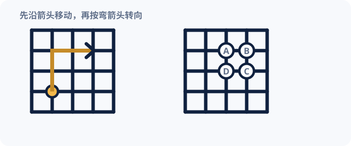

**选项：** A．A　B．B　C．C　D．D

**正确答案：** B

**标准推导：** 从橙点沿路径先上移两格，再右移两格，箭头终点落在B。

**唯一答案检查：** 路径的唯一箭头终点与B标记重合，其他位置分别对应少走或漏走一步。

**其他选项不成立：**

- A：向右少走一格。
- C：向上少走一格。
- D：向上、向右均少走一格。

#### S06-2

**学生端题目：** 把左侧箭头整体翻到虚线另一侧，哪一项正确？
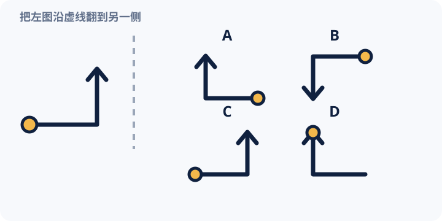

**选项：** A．A　B．B　C．C　D．D

**正确答案：** A

**标准推导：** 关于竖直虚线翻面后，橙点移到右下，路径先向左再向上，箭头仍指向上方，对应A。

**唯一答案检查：** 竖直镜像保持上下关系、反转左右关系；只有A同时满足起点、折角和箭头方向。

**其他选项不成立：**

- B：把上下方向也错误翻转。
- C：保持了原图左右方向，只做了平移。
- D：把橙点放到了箭头端。

### 29｜R06｜推演·推出结论

- 主要测量元能力：推演
- 对应二级能力：推出结论
- 可能同时调用：语言
- 题型：symbol-text-chain
- 为什么能测目标能力：所有前提均为题内虚构关系，只有沿条件方向进行有效传递才能得到必然结论。
- 可能受其他能力影响：语言（不作为本题主结论）
- 难度：中等
- 预计作答时间：34秒
- 知识依赖风险：低；关系均在题内给出。
- 阅读依赖风险：中；需要保持短关系链方向。
- 题型经验风险：低；链长不超过三步。
- 任务计分：内部2次作答先求正确率，再折算为本任务1分
- 学生题干：根据题目给出的关系，哪一项一定对？

#### R06-1

**学生端题目：** 图中箭头表示“早于”：箭头起点的事件早于终点。四个事件时间均不同。哪一项中的两句话都一定成立？
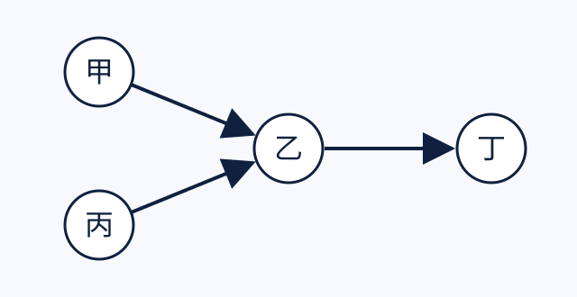

**选项：** A．甲早于丙；丙早于丁　B．丙早于甲；甲早于丁　C．甲早于丁；丙早于丁　D．甲早于丁；丁早于丙

**正确答案：** C

**标准推导：** 甲→乙→丁和丙→乙→丁分别推出甲、丙早于丁；甲与丙之间的先后未被限定。

**唯一答案检查：** 枚举全部满足图中三条有向边的事件排列，仅C的两句话在每一种排列中都成立。节点屏幕位置不额外表示时间先后。

**其他选项不成立：**

- A：第一句没有被条件限定。
- B：第一句没有被条件限定。
- D：第二句与丙→乙→丁矛盾。

#### R06-2

**学生端题目：** 若P发生，则Q发生；若Q和S都发生，则T发生。已知P发生而T未发生。一定成立的是？

**选项：** A．Q未发生，S发生　B．Q发生，S也发生　C．Q未发生，S未发生　D．Q发生，S未发生

**正确答案：** D

**标准推导：** P发生推出Q发生。若S也发生，则Q与S共同推出T，与T未发生矛盾；所以S未发生。

**唯一答案检查：** 逐项代入题干条件后，仅正确项同时满足全部条件，其余选项各有一处明确冲突。

**其他选项不成立：**

- A：Q未发生与P→Q及已知P冲突。
- B：Q、S都发生将推出T，违反已知。
- C：Q未发生与已知推出的Q冲突。

### 30｜M06｜记忆·准确提取

- 主要测量元能力：记忆
- 对应二级能力：准确提取
- 可能同时调用：语言
- 题型：similar-distractor-position-retrieval
- 为什么能测目标能力：目标与相似干扰或位置干扰同时出现；必须从记忆中提取精确特征，只有记住大类不足以作答。
- 可能受其他能力影响：语言（不作为本题主结论）
- 难度：中等
- 预计作答时间：24秒
- 知识依赖风险：低；只使用新符号。
- 阅读依赖风险：低；题干短。
- 题型经验风险：中；六项序列对位置提取有一定负荷。
- 任务计分：内部3次作答先求正确率，再折算为本任务1分
- 学生题干：六个符号记忆：找出指定位置的图形。

#### M06-1

**学生端题目：** 第2个出现的符号是？

**选项：** A．◐　B．☾　C．◑　D．◒

**正确答案：** B

**标准推导：** 六项材料的第2位是开口朝右的月牙“☾”，其余选项只改变填充或开口方向。

**唯一答案检查：** 逐项代入题干条件后，仅正确项同时满足全部条件，其余选项各有一处明确冲突。

**其他选项不成立：**

- A：把月牙误记成半实心圆。
- C：把月牙误记成右半填充圆。
- D：把弧形误记成下半填充。

#### M06-2

**学生端题目：** 第4个出现的符号是？

**选项：** A．◆　B．◈　C．◇　D．⬟

**正确答案：** B

**标准推导：** 第4位是带中心小菱形的轮廓菱形“◈”；A全实心，C缺少中心，D边数不同。

**唯一答案检查：** 逐项代入题干条件后，仅正确项同时满足全部条件，其余选项各有一处明确冲突。

**其他选项不成立：**

- A：只记住了菱形类别，错记填充。
- C：遗漏中心特征。
- D：混淆了相邻的多边形。

#### M06-3

**学生端题目：** 第5个出现的符号是？

**选项：** A．◇　B．◈　C．◆　D．◊

**正确答案：** A

**标准推导：** 第5位是单一空心菱形“◇”，没有中心点或实心填充。

**唯一答案检查：** 逐项代入题干条件后，仅正确项同时满足全部条件，其余选项各有一处明确冲突。

**其他选项不成立：**

- B：把第4位的中心特征带入第5位。
- C：把空心误记成实心。
- D：把宽菱形误记成窄菱形。

## 4. 五项元能力覆盖与难度分布

| 元能力 | 任务数 | 二级能力 | 基础 | 中等 | 挑战 | 总分 |
| --- | ---: | --- | ---: | ---: | ---: | ---: |
| 记忆 | 6 | 快速记住、保持信息、准确提取 | 2 | 3 | 1 | 6分 |
| 语言 | 6 | 理解意思、组织信息、准确表达 | 2 | 3 | 1 | 6分 |
| 数理 | 6 | 感知数量、理解变化、处理符号 | 2 | 3 | 1 | 6分 |
| 空间 | 6 | 识别结构、空间想象、空间转换 | 2 | 3 | 1 | 6分 |
| 推演 | 6 | 发现关系、归纳规律、推出结论 | 2 | 3 | 1 | 6分 |

计分规则：每个任务单元统一1分；每项元能力6分；每项二级能力2分。二级能力只作为解释性信号，不做精细排名或确定性判断。

## 5. 逐题审查

| 任务 | 测量目标 | 为什么能测 | 可能受何种能力影响 | 唯一答案 | 能力混淆 | 知识依赖 | 手机可读性 | 预计时间 |
| --- | --- | --- | --- | --- | --- | --- | --- | ---: |
| M01 | 记忆·快速记住 | 材料只呈现一次，随后立即撤去；正确作答必须保留新图形或虚构配对，而不能从常识补出答案。 | 空间 | 答案键与解析齐全；非逻辑证明 | 次要调用已标注 | 低 | 文字长度符合；需实机复核 | 20秒 |
| L01 | 语言·理解意思 | 选项系统改变对象、范围、否定或指代；只有准确理解原句边界才能排除近义误读。 | 记忆 | 答案键与解析齐全；非逻辑证明 | 次要调用已标注 | 低 | 文字长度符合；需实机复核 | 22秒 |
| N01 | 数理·感知数量 | 点阵加载后呈现8秒，收起后作答，观察数量比较表现。8秒内仍可能计数，不作为纯粹近似数感指标；记忆保持间隔按实际时间记录，不参与计分。 | 空间 | 答案键与解析齐全；非逻辑证明 | 次要调用已标注 | 低 | 文字长度符合；需实机复核 | 20秒 |
| S01 | 空间·识别结构 | 候选共享大量局部特征，只有追踪连接、转折与端点关系才能找到目标结构。 | 记忆 | 答案键与解析齐全；非逻辑证明 | 空间操作为核心 | 低 | 文字长度符合；需实机复核 | 28秒 |
| R01 | 推演·发现关系 | 新符号之间的对应只由示例给出，必须抽取关系并迁移到新对象，不能调用生活常识。 | 空间 | 答案键与解析齐全；非逻辑证明 | 图形负荷受控 | 低 | 文字长度符合；需实机复核 | 23秒 |
| M02 | 记忆·快速记住 | 材料只呈现一次，随后立即撤去；正确作答必须保留新图形或虚构配对，而不能从常识补出答案。 | 语言 | 答案键与解析齐全；非逻辑证明 | 次要调用已标注 | 低 | 文字长度符合；需实机复核 | 21秒 |
| L02 | 语言·理解意思 | 选项系统改变对象、范围、否定或指代；只有准确理解原句边界才能排除近义误读。 | 记忆 | 答案键与解析齐全；非逻辑证明 | 次要调用已标注 | 低 | 文字长度符合；需实机复核 | 29秒 |
| N02 | 数理·感知数量 | 题目控制或隐藏精确数值，要求比较整体数量或连续位置；不能靠已学公式直接求解。 | 空间 | 答案键与解析齐全；非逻辑证明 | 次要调用已标注 | 低 | 文字长度符合；需实机复核 | 24秒 |
| S02 | 空间·识别结构 | 候选共享大量局部特征，只有追踪连接、转折与端点关系才能找到目标结构。 | 推演 | 答案键与解析齐全；非逻辑证明 | 空间操作为核心 | 低 | 文字长度符合；需实机复核 | 32秒 |
| R02 | 推演·发现关系 | 新符号之间的对应只由示例给出，必须抽取关系并迁移到新对象，不能调用生活常识。 | 数理 | 答案键与解析齐全；非逻辑证明 | 非空间主导 | 低 | 文字长度符合；需实机复核 | 28秒 |
| L03 | 语言·组织信息 | 句子内容相同但顺序不同；必须依据因果、转折和指代把信息组织成连贯结构。 | 推演 | 答案键与解析齐全；非逻辑证明 | 次要调用已标注 | 低 | 文字长度符合；需实机复核 | 24秒 |
| N03 | 数理·理解变化 | 答案由相邻变化或两个量的共同变化决定；只看单个数值无法完成。 | 推演 | 答案键与解析齐全；非逻辑证明 | 次要调用已标注 | 低 | 文字长度符合；需实机复核 | 30秒 |
| S03 | 空间·空间想象 | 目标结果不可直接从文字读出，必须在头脑中完成旋转或拼合，再与可视化候选核对。 | 记忆 | 答案键与解析齐全；非逻辑证明 | 空间操作为核心 | 低 | 文字长度符合；需实机复核 | 30秒 |
| R03 | 推演·归纳规律 | 下一项未直接给出，必须从连续实例中归纳稳定变换；干扰项对应只跟踪局部特征的错误。 | 数理 | 答案键与解析齐全；非逻辑证明 | 图形负荷受控 | 低 | 文字长度符合；需实机复核 | 26秒 |
| M03 | 记忆·保持信息 | 目标信息在作答时不再可见，并经过其他任务或较长间隔；得分取决于能否保持指定内容而非重新辨认材料。 | 语言 | 答案键与解析齐全；非逻辑证明 | 次要调用已标注 | 低 | 文字长度符合；需实机复核 | 28秒 |
| L04 | 语言·组织信息 | 句子内容相同但顺序不同；必须依据因果、转折和指代把信息组织成连贯结构。 | 推演 | 答案键与解析齐全；非逻辑证明 | 次要调用已标注 | 低 | 文字长度符合；需实机复核 | 34秒 |
| N04 | 数理·理解变化 | 答案由相邻变化或两个量的共同变化决定；只看单个数值无法完成。 | 推演 | 答案键与解析齐全；非逻辑证明 | 次要调用已标注 | 低 | 文字长度符合；需实机复核 | 28秒 |
| S04 | 空间·空间想象 | 目标结果不可直接从文字读出，必须在头脑中完成旋转或拼合，再与可视化候选核对。 | 推演 | 答案键与解析齐全；非逻辑证明 | 空间操作为核心 | 低 | 文字长度符合；需实机复核 | 35秒 |
| R04 | 推演·归纳规律 | 下一项未直接给出，必须从连续实例中归纳稳定变换；干扰项对应只跟踪局部特征的错误。 | 数理 | 答案键与解析齐全；非逻辑证明 | 非空间主导 | 低 | 文字长度符合；需实机复核 | 38秒 |
| M04 | 记忆·保持信息 | 目标信息在作答时不再可见，并经过其他任务或较长间隔；得分取决于能否保持指定内容而非重新辨认材料。 | 语言 | 答案键与解析齐全；非逻辑证明 | 次要调用已标注 | 低 | 文字长度符合；需实机复核 | 24秒 |
| L05 | 语言·准确表达 | 各选项共享主题但在范围、指代或执行信息上有细微差异；作答要求辨认表达是否完整准确。 | 推演 | 答案键与解析齐全；非逻辑证明 | 次要调用已标注 | 低 | 文字长度符合；需实机复核 | 28秒 |
| N05 | 数理·处理符号 | 符号含义完全在题内定义，必须保持并执行新规则；熟悉的运算符经验不能直接替代。 | 推演 | 答案键与解析齐全；非逻辑证明 | 次要调用已标注 | 低 | 文字长度符合；需实机复核 | 30秒 |
| S05 | 空间·空间转换 | 必须把平面图转换成立体关系，或对图示位置执行方向变换；答案取决于变换后的相对位置。 | 推演 | 答案键与解析齐全；非逻辑证明 | 空间操作为核心 | 低 | 文字长度符合；需实机复核 | 34秒 |
| R05 | 推演·推出结论 | 所有前提均为题内虚构关系，只有沿条件方向进行有效传递才能得到必然结论。 | 语言 | 答案键与解析齐全；非逻辑证明 | 非空间主导 | 低 | 文字长度符合；需实机复核 | 32秒 |
| M05 | 记忆·准确提取 | 目标与相似干扰或位置干扰同时出现；必须从记忆中提取精确特征，只有记住大类不足以作答。 | 空间 | 答案键与解析齐全；非逻辑证明 | 次要调用已标注 | 低 | 文字长度符合；需实机复核 | 30秒 |
| L06 | 语言·准确表达 | 各选项共享主题但在范围、指代或执行信息上有细微差异；作答要求辨认表达是否完整准确。 | 推演 | 答案键与解析齐全；非逻辑证明 | 次要调用已标注 | 低 | 文字长度符合；需实机复核 | 30秒 |
| N06 | 数理·处理符号 | 符号含义完全在题内定义，必须保持并执行新规则；熟悉的运算符经验不能直接替代。 | 推演 | 答案键与解析齐全；非逻辑证明 | 次要调用已标注 | 低 | 文字长度符合；需实机复核 | 38秒 |
| S06 | 空间·空间转换 | 必须把平面图转换成立体关系，或对图示位置执行方向变换；答案取决于变换后的相对位置。 | 记忆 | 答案键与解析齐全；非逻辑证明 | 空间操作为核心 | 低 | 文字长度符合；需实机复核 | 24秒 |
| R06 | 推演·推出结论 | 所有前提均为题内虚构关系，只有沿条件方向进行有效传递才能得到必然结论。 | 语言 | 答案键与解析齐全；非逻辑证明 | 非空间主导 | 低 | 文字长度符合；需实机复核 | 34秒 |
| M06 | 记忆·准确提取 | 目标与相似干扰或位置干扰同时出现；必须从记忆中提取精确特征，只有记住大类不足以作答。 | 语言 | 答案键与解析齐全；非逻辑证明 | 次要调用已标注 | 低 | 文字长度符合；需实机复核 | 24秒 |

审查结论：30个任务均已写入唯一答案检查、完整正向推导和逐项干扰解释。R04只追踪形状与数字两类独立规则，不使用复杂空间旋转；推演保持图形规律、极简符号关系和短文本推理的组合。此处是内容审查结论，不替代预测试数据。

## 6. 预计总时长

- 正式任务：848秒（14分08秒）
- 记忆材料：78秒
- 操作说明阅读预留（题内展示，无额外答题）：66秒
- 页面说明与切换：72秒
- 实际计分选择次数：65次
- 题库静态估算合计：1064秒（17分44秒）
- 学生页显示“预计15～18分钟”，是预估范围，不是实测保证。总体中位数、P90、阅读慢学生用时，以及每题和示例耗时均待预测试验证。
- 时长结论：待预测试验证。静态加总只用于安排测试，不宣称已经满足15分钟目标。

## 7. 仍需通过预测试验证的问题

1. 每题实际通过率是否符合基础、中等、挑战的预设顺序。
2. 每个干扰项是否都有足够选择率，能否区分具体误判，而非成为明显废项。
3. 65次实际选择在手机端的中位完成时长及P90时长是否能控制在目标范围。
4. 视觉位置板24秒、语义配对24秒、序列18秒与12秒是否既能理解又不会出现天花板效应。
5. SVG点阵、数轴与空间图形在不同尺寸手机上是否稳定、易辨认；SVG视觉记忆图形是否等大清晰；剩余序列符号在不同系统字体中是否等价。
6. L04、R04、N06、S05、M05五个挑战任务是否形成适度挑战，而不是突然增加阅读或题型经验负担。
7. 记忆即时与延迟子集虽不重合，学生是否仍会用类别线索间接强化延迟材料。
8. 每个二级能力只有两个任务，信号稳定性是否足以用于解释；预测试前不据此排名。
9. 五项元能力分数的内部一致性、重测稳定性和任务间相关结构是否支持当前解释边界。
10. “准确表达”的任务证据是否被正确理解为选择题中的表达判断，而不是开放式表达水平。
